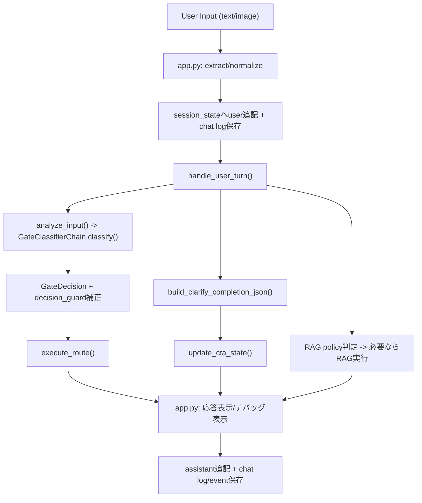

# `app.py`起点のコードリーディングガイド（現行ワークフロー）

このガイドは、改善点を洗い出す前提として、現行実装を `app.py` から追うための実践メモです。  
目的は「どこで何が決まり、どこに副作用があるか」を短時間で把握することです。

## 1. 現在のワークフロー（全体像）

## 2. `app.py` の読み方（推奨順）

### Step 1: エントリ処理だけ読む（UI骨格）
- [app.py](/Users/yoshi/zacitra_ws/sandbox_hiranuma/rag_experiment/app.py)
- 見るポイント:
  - `load_dotenv()` 実行タイミング
  - `get_chat_logger()` でロガーを `st.session_state` 復元する流れ
  - `initialize_session_state()` 呼び出し位置
  - `render_rag_sidebar()` と `render_chat_history()` の描画順

### Step 2: 入力から1ターン処理呼び出しまで
- [app.py](/Users/yoshi/zacitra_ws/sandbox_hiranuma/rag_experiment/app.py)
- 見るポイント:
  - `extract_chat_submission()` で text/image を分離
  - `normalize_display_text()` と `normalize_gate_text()` の役割差
  - `append_user_message()` と `chat_logger.log_message()` の二重記録（UI状態と永続ログ）
  - `handle_user_turn()` に渡す入力は `gate_text` である点

### Step 3: 1ターンの業務ロジック本体
- [src/chat_ui/turn_handler.py](/Users/yoshi/zacitra_ws/sandbox_hiranuma/rag_experiment/src/chat_ui/turn_handler.py)
- 呼び出し順:
  1. `analyze_input()`（Gate判定）
  2. `execute_route()`（routeに応じた返答）
  3. `build_clarify_completion_json()`（CLARIFY/CTA抽出）
  4. `update_cta_state()`（CTA進捗更新）
  5. `update_idea_buffer()`（RAGトリガ用バッファ更新）
  6. `_build_rag_debug()`（RAG実行判定と実行）

### Step 4: Gate判定の中身
- [src/agents/gate.py](/Users/yoshi/zacitra_ws/sandbox_hiranuma/rag_experiment/src/agents/gate.py)
- [src/chains/gate_classifier.py](/Users/yoshi/zacitra_ws/sandbox_hiranuma/rag_experiment/src/chains/gate_classifier.py)
- [src/middleware/prompt_middleware.py](/Users/yoshi/zacitra_ws/sandbox_hiranuma/rag_experiment/src/middleware/prompt_middleware.py)
- [src/middleware/decision_guard.py](/Users/yoshi/zacitra_ws/sandbox_hiranuma/rag_experiment/src/middleware/decision_guard.py)
- 見るポイント:
  - `dynamic_prompt` で system prompt を注入している箇所
  - Structured Output (`GateDecision`) のスキーマ生成
  - `apply_decision_overrides()` による後段補正
  - `build_clarify_completion_json()` の `cta_slots` 推定と `cta_is_complete`

### Step 5: RAGの発火条件と実行
- [src/chat_ui/rag_policy.py](/Users/yoshi/zacitra_ws/sandbox_hiranuma/rag_experiment/src/chat_ui/rag_policy.py)
- [src/tools/rag_tools.py](/Users/yoshi/zacitra_ws/sandbox_hiranuma/rag_experiment/src/tools/rag_tools.py)
- [src/rag/reflection_context.py](/Users/yoshi/zacitra_ws/sandbox_hiranuma/rag_experiment/src/rag/reflection_context.py)
- 見るポイント:
  - `BOUNDARY_ROUTES` でRAGを止める条件
  - `RAG_STREAK_TRIGGER` と `RAG_COOLDOWN_TURNS` の相互作用
  - 同一クエリスキップ (`should_skip_same_query`)

### Step 6: 状態と表示の責務境界
- [src/chat_ui/session_state.py](/Users/yoshi/zacitra_ws/sandbox_hiranuma/rag_experiment/src/chat_ui/session_state.py)
- [src/chat_ui/cta_state.py](/Users/yoshi/zacitra_ws/sandbox_hiranuma/rag_experiment/src/chat_ui/cta_state.py)
- [src/chat_ui/rendering.py](/Users/yoshi/zacitra_ws/sandbox_hiranuma/rag_experiment/src/chat_ui/rendering.py)
- 見るポイント:
  - `messages`（表示用）と `llm_context`（判定用）の二層構造
  - `rag_meta` / `idea_buffer` / `cta_state` の更新責務
  - `debug_info` がUI表示とログ保存の共通ペイロードになっている点

## 3. 初回レンダーと1ターンの状態変化

### 初回レンダー時
- `messages` 初期化（assistant初期メッセージ）
- `llm_context` 初期化（assistant初期メッセージ）
- `idea_buffer` 初期化
- `rag_meta` 初期化
- `cta_state` 初期化
- 初回のみ `chat_logger` に初期assistantメッセージを記録

### 入力1ターン時
- userメッセージを `messages` と `llm_context` へ追記
- Gate判定で `route/reason/first_question` を得る
- `clarify_json` と `cta_state` を更新
- `idea_buffer` と `rag_meta` を更新（必要ならRAG実行）
- assistant応答と `debug_info` を `messages` に追記
- 同内容をJSONLログへ保存

## 4. 改善点を洗うときのチェックリスト

### A. 処理責務
- `app.py` に業務ロジックが再流入していないか
- `turn_handler.py` が肥大化しすぎていないか
- `decision_guard.py` のルールがUI要件を侵食していないか

### B. 状態整合性
- `messages` と `llm_context` の不一致ケースがないか
- `cta_state.next_focus` が `None` になるケースの扱いが妥当か
- `FINISH/PARK` 時のバッファクリア方針が意図通りか

### C. 観測可能性（デバッグ性）
- `debug_info` のキーが画面表示・ログで一貫しているか
- 失敗時に必要な情報（input, route, token_usage）が残るか
- Gate traceとchat logの対応づけが容易か

### D. 仕様の境界条件
- 画像のみ入力時の `normalize_gate_text()` 挙動
- `decision_guard` が意図せず `FINISH` に倒しすぎないか
- `RAG` の cooldown と streak が実運用の会話テンポに合っているか

## 5. 併読すると理解が速い資料
- [docs/current-workflow.md](/Users/yoshi/zacitra_ws/sandbox_hiranuma/rag_experiment/docs/current-workflow.md)
- [docs/directory-structure.md](/Users/yoshi/zacitra_ws/sandbox_hiranuma/rag_experiment/docs/directory-structure.md)
- [prompts/gate_prompt.md](/Users/yoshi/zacitra_ws/sandbox_hiranuma/rag_experiment/prompts/gate_prompt.md)
- [tests/test_gate.py](/Users/yoshi/zacitra_ws/sandbox_hiranuma/rag_experiment/tests/test_gate.py)
- [tests/test_rag_policy.py](/Users/yoshi/zacitra_ws/sandbox_hiranuma/rag_experiment/tests/test_rag_policy.py)
- [tests/test_cta_state.py](/Users/yoshi/zacitra_ws/sandbox_hiranuma/rag_experiment/tests/test_cta_state.py)

## 6. まず30分で読むならこの順番
1. [app.py](/Users/yoshi/zacitra_ws/sandbox_hiranuma/rag_experiment/app.py)
2. [src/chat_ui/turn_handler.py](/Users/yoshi/zacitra_ws/sandbox_hiranuma/rag_experiment/src/chat_ui/turn_handler.py)
3. [src/chains/gate_classifier.py](/Users/yoshi/zacitra_ws/sandbox_hiranuma/rag_experiment/src/chains/gate_classifier.py)
4. [src/middleware/decision_guard.py](/Users/yoshi/zacitra_ws/sandbox_hiranuma/rag_experiment/src/middleware/decision_guard.py)
5. [src/chat_ui/rag_policy.py](/Users/yoshi/zacitra_ws/sandbox_hiranuma/rag_experiment/src/chat_ui/rag_policy.py)
6. [src/chat_ui/session_state.py](/Users/yoshi/zacitra_ws/sandbox_hiranuma/rag_experiment/src/chat_ui/session_state.py)
